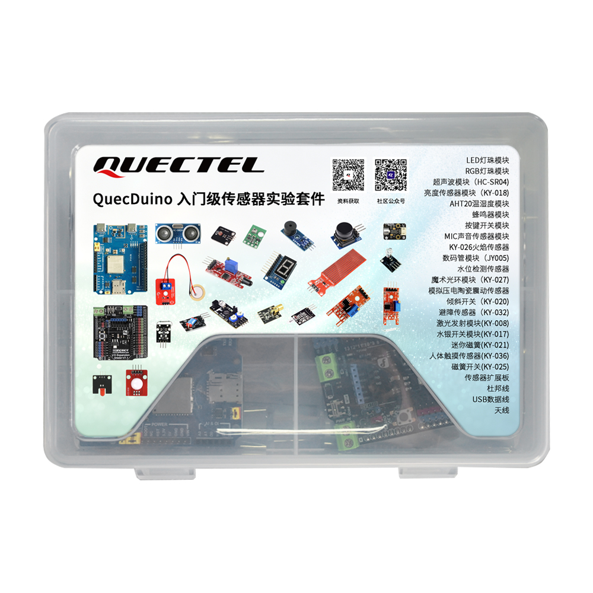
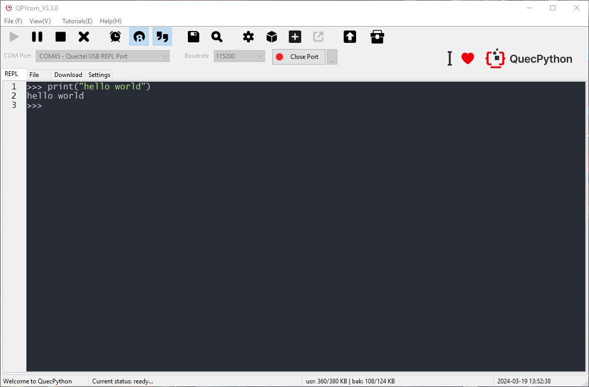
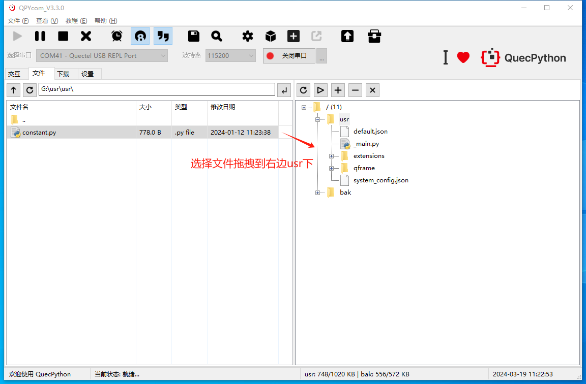

# QuecDuino 入门级传感器实验套件

### **产品介绍**



这是一款由EG800Z系列QuecDuino开发板与二十余种传感器及执行器深度融合打造的入门级实验套件。

QuecDuino入门级传感器实验套件，是专为初学者、创客及教育领域量身定制的一站式开发平台。它完美继承了Arduino开源硬件的易用基因，并创新性地集成了移远通信（Quectel）领先的蜂窝网络技术，让您的物联网构想摆脱繁琐配置，轻松照进现实。

**产品特点**

- **物联网开发**：不同于传统的 Arduino Uno，本套件内置网络通信能力，让你写的代码可以直接连接互联网，无需依赖电脑或额外的 WiFi 模块。
- **Python 上手零门槛**：利用 Python 语言的简洁性，让初学者能跳过复杂的寄存器配置，直接关注物联网逻辑和业务实现。
- **工业级稳定性**：采用移远通信 (Quectel) 工业级模组，适应 -35℃ 到 85℃ 的宽温工作环境，不仅适合学习，也适合工业原型验证。
- **传感器丰富**：多达数十种传感器外设供用户学习使用，丰富的硬件组合能完美还原真实的物联网开发需求。

> !! 本仓库收录 QuecDuino 入门级传感器实验套件搭配使用的基于 QuecPython 开发平台的实验案例。
>
> 更多关于 QuecPython 平台开发方式，请访问 [QuecPython文档中心](https://developer.quectel.com/doc/quecpython/)

### **案例清单**

|      | Module                                                       | 描述                                                         |
| ---- | ------------------------------------------------------------ | ------------------------------------------------------------ |
| 01   | [LED Module](example/01-led/README.md)                       | 基础 IO 输出控制案例，通过高低电平实现 LED 亮灭，是嵌入式入门最基础的数字输出实践。 |
| 02   | [Single Button Module](example/02-key_interrupt/README.md)   | 基础 IO 输入检测案例，实现按键按下 / 松开逻辑，学习按键状态识别。 |
| 03   | [RGB LED Module](example/03-rgb_led/README.md)               | 实现红 / 绿 / 蓝三原色混色。                                 |
| 04   | [Microphone (MIC) Module](example/04-mic/README.md)          | 检测周围环境中的声音强度。                                   |
| 05   | [Buzzer Module](example/05-buzzer/README.md)                 | 蜂鸣器控制案例，可实现固定音调提示音。                       |
| 06   | [Water Level Detection Module](example/06-water_level_detect/README.md) | 电阻式液体检测传感器，检测水位高度、有无水、漏水报警等场景。 |
| 07   | [Reed Switch Module (KY-025)](example/07-magnetic_reed_switch(KY-025)/README.md) | 干簧管磁感应开关，靠近磁铁时触发通断信号。                   |
| 08   | [Obstacle Detection Module (KY-032)](example/08-Obstacle_Detection_Module(KY-032)/README.md) | 障碍物检测模块是红外反射式数字检测器件，也叫红外避障模块，用于近距离障碍物检测、循迹、避障、限位触发。 |
| 09   | [Mini Reed Switch (KY-021)](example/09-Mini_Magnetic(KY-021)/README.md) | 迷你磁簧，全称迷你磁簧开关（干簧管模块），是一种利用磁场控制通断的无源开关组件，这类磁性感应器件一般作为门磁检测、位置检测、限位触发使用。 |
| 10   | [Photoresistor Module (KY-018)](example/10-photoresistor(KY-018)/README.md) | 光敏电阻传感器是一种能够将光信号转换为电信号的传感器，其阻值会随着光照强度的变化而改变。 |
| 11   | [Flame Detection Module (KY-026)](example/11-flame_detect(KY-026)/README.md) | 火焰检测模块是用于探测火焰 / 明火的传感器模块，通过接收火焰产生的红外光，输出高低电平信号，实现火灾报警、火源检测。 |
| 12   | [Magic Light Cup Module (KY-027)](example/12-Magic_Aura_Module(KY-027)/README.md) | 魔术光环模块（KY‑027）是倾斜感应 + LED 发光二合一数字模块，内置水银开关与高亮 LED，用于倾斜检测、姿态触发、状态指示、创客互动项目。 |
| 13   | [Tilt Switch Module (KY-020)](example/13-Inclination_switch_module(KY-020)/README.md) | 倾斜开关是姿态感应数字开关器件，也被称作滚珠开关、倾倒传感器，常用于倾斜检测、防倒保护、姿态触发、智能报警场景。 |
| 14   | [Ultrasonic Module (HC-SR04)](example/14-Ultrasonic_module(HC-SR04)/README.md) | 基于声波反射的距离测量传感器，通过发射与接收超声波计算物体距离，常用于小车测距、障碍物检测、液位 / 水位测量场景。 |
| 15   | [Human Touch Module (KY-036)](example/15-Human_body_touch_module(KY-036)/README.md) | 电容式触摸检测传感器，通过人体触碰改变电容信号，实现触摸开关、触摸按键功能，替代传统机械按键提升交互体验。 |
| 16   | [Digital Tube Module (JY005)](example/16-Digital_tube_module(JY005)/README.md) | 单位数码管模块是数字显示器件，由 7 段发光二极管组成，用于显示 0-9 数字及简单符号，广泛用于计数、计时、状态显示、创客 DIY 场景。 |
| 17   | [Laser Transmitter Module (KY-008)](example/17-Laser_emission_module(KY-008)/README.md) | 激光发射模块通过半导体激光二极管，将电能高效转化为激光发射出去。它广泛用于激光测距、激光雷达、光纤通信、激光指示、红外夜视等场景。 |
| 18   | [Mercury Switch Module (KY-017)](example/18-Mercury_switch_module(KY-017)/README.md) | 水银开关模块，常用于倾斜报警、防倒保护、姿态检测、触发控制场景。 |
| 19   | [Temperature & Humidity Sensor (AHT20)](example/19-temperature_and_humidity_sensor(AHT20)/README.md) | 温湿度传感器作为常见的传感器之一，是一种装有湿敏和热敏元件，能够用来测量温度和湿度的传感器装置。 |
| 20   | [Analog Piezoelectric Vibration Sensor](example/20-Simulated_Piezoelectric_Ceramic_Vibration_Sensor/README.md) | 模拟压电陶瓷震动传感器是一款用于检测振动、碰撞或者声波的传感器模块。它使用压电陶瓷技术，能够在受到压力或震动时输出相应的模拟信号。 |

# EG800Z Duino 开发板固件烧录&使用指导

##  工具下载

请按照如下链接分别下载固件烧录工具和开发调试工具。

固件烧录工具：[QFlash](https://developer.quectel.com/wp-content/uploads/2024/09/QFlash_V7.4_CN.zip)

开发调试工具：[QPYcom](https://developer.quectel.com/wp-content/uploads/2024/09/QPYcom_V4.1.0.zip)

## 固件烧录指导

### 1. 打开 QFlash 程序，点击“**Load FW Files**” 导入固件文件

> !! 请从本仓库的 firmware 文件夹中，获取 QPY_OCPU_EG800Z_CNLA_FW.zip 并解压。


*图1：固件烧录-加载固件文件*

### 2. 选择烧录文件

选择固件包中的`at_command.hbinpkg`文件，点击确定后自动导入。


*图2：固件烧录-选择要下载的固件文件*

### 3. 设备固件下载模式

使用杜邦线短接 **BOOT** 引脚进入下载模式，打开设备管理器，重启设备，查看“端口 (COM 和 LPT)”中的 Quectel QDLoader Port，记录 COM 通道号。


*图3：固件烧录-记录COM通道号*

### 4. 开始下载固件

在 QFlash 中选择对应 COM 通道，点击“**Start**”开始下载，等待进度条完成并显示“**PASS**”。


*图4：固件烧录-“Start”按钮*

下载进程监控


*图5：固件烧录-单击“Start”按钮后自动开始固件升级*

下载完成


*图6：固件烧录-固件升级成功*

## 使用 QPYCom 工具

> !! REPL全称为**Read-Eval-Print-Loop (交互式解释器)**，可以在REPL中进行 QuecPython 程序的调试，是 QPYCom 工具用于 QuecPython 平台提供的主要的开发调试方式。
>
> !! 访问 QuecPython 快速入门：https://developer.quectel.com/doc/quecpython/Getting_started/zh/index.html
>
> !! 更多 QPYCom 工具使用请访问：https://developer.quectel.com/doc/quecpython/Application_guide/zh/dev-tools/QPYcom/index.html

### 通过 REPL 口调试代码

运行 **QPYcom** 工具后，选择正确的串口（波特率无需指定）并打开，即可开始 Python 命令行交互。

- **Step1：进入交互页面**

进入交互页面首先需要打开USB交互口，注意不同平台交互口名称有差异

打开QPYcom工具，端口选择连接**Quectel USB REPL Port**，选择“交互”界面

- **Step2：打开串口**

点击“打开串口”按钮，在交互界面输入**print(‘hello world’)**，按回车后可以看到执行的结果信息

```none
>>> print('hello world')
hello world
```



### 脚本下载运行调试

> !! 本仓库提供的 example 脚本文件，均可以下载至模组usr目录中并执行运行。

如下图所示，直接将本地文件通过拖拽方式下载到模组usr目录下。



脚本下载流程：

- **Step1：打开REPL串口**

首先选择模组的交互口,点击“**打开串口**”按钮

- **Step2：通过工具按钮下载**（可选）

可以通过文件页面右侧上面的 "**+**","**-**" 按钮来上传和删除文件

- **Step3：通过拖拽形式下载**（可选）

也可以通过拖拽的方式将文件页面左侧显示的本地文件直接拖拽到右侧模组中去（也可以拖拽文件夹）

- **Step4：下载进度和结果**

下载过程中会在状态栏显示下载文件名和下载进度

- **Step5：运行脚本**

在右侧栏中右键脚本文件，并选择执行即可。


## **相关资料**

[查看开发板相关资料](./media/Quectel_QuecDuion_开发套件_用户手册_V1.0.pdf)