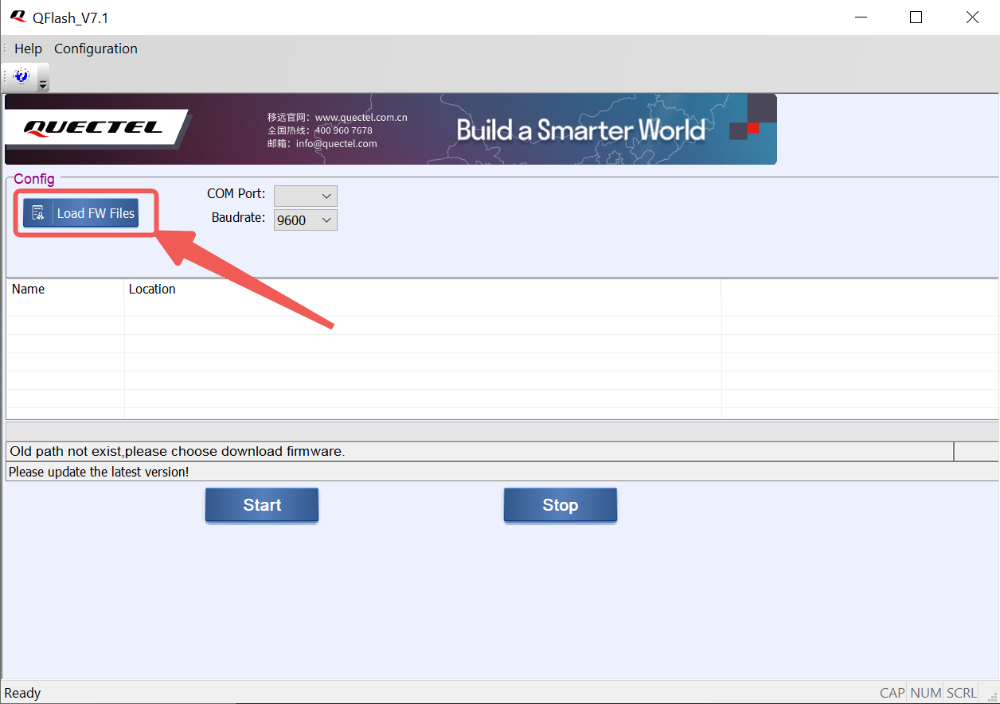
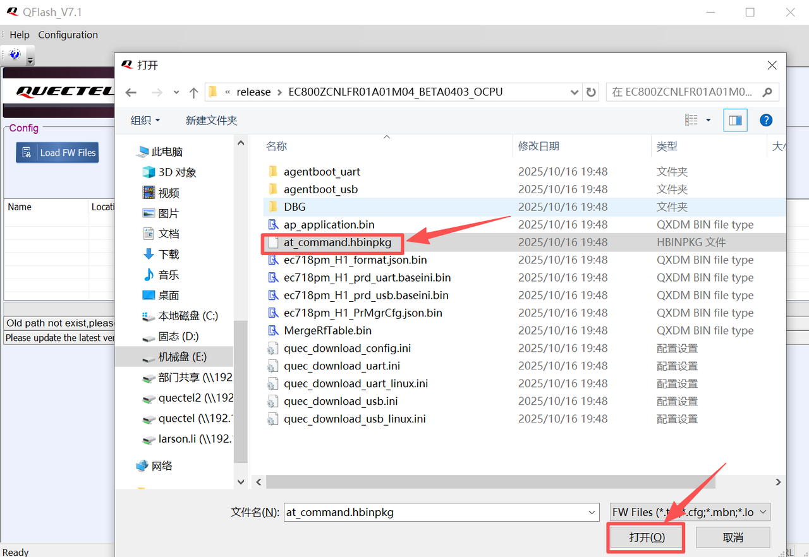
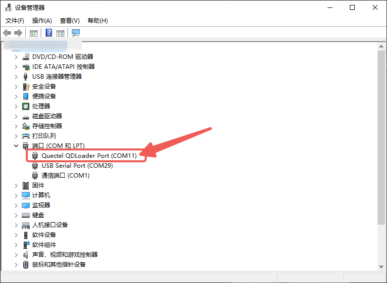
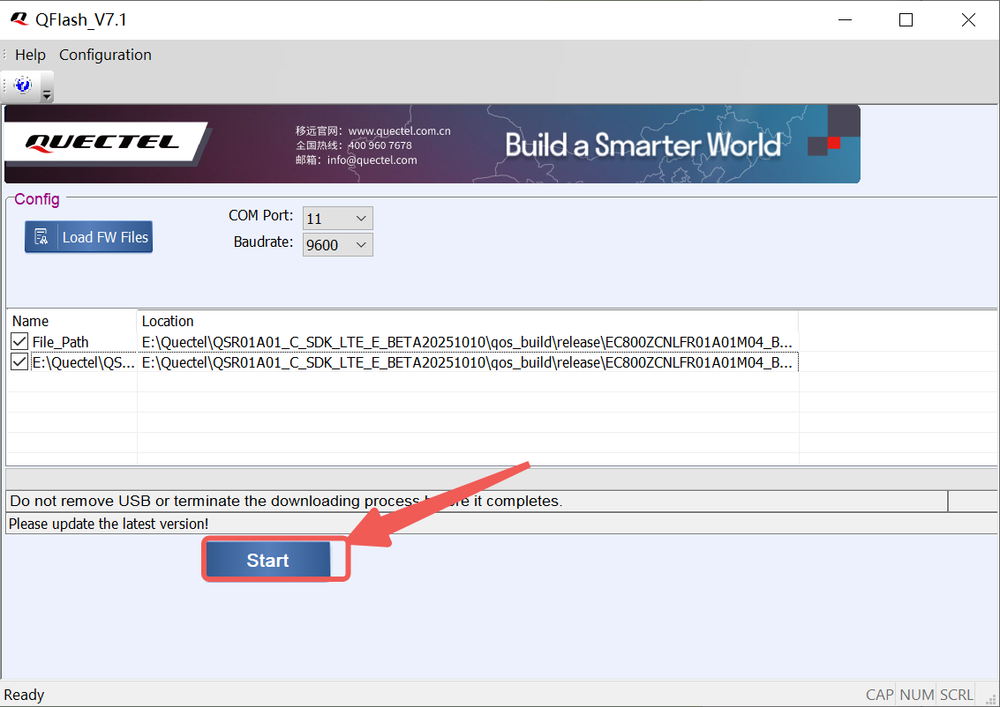
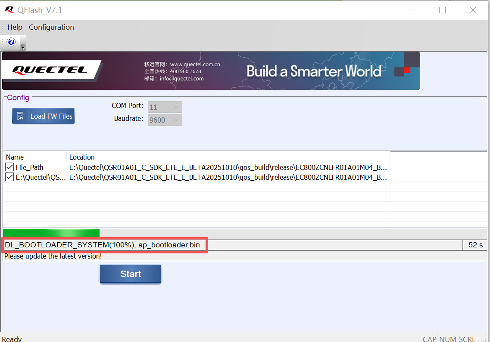
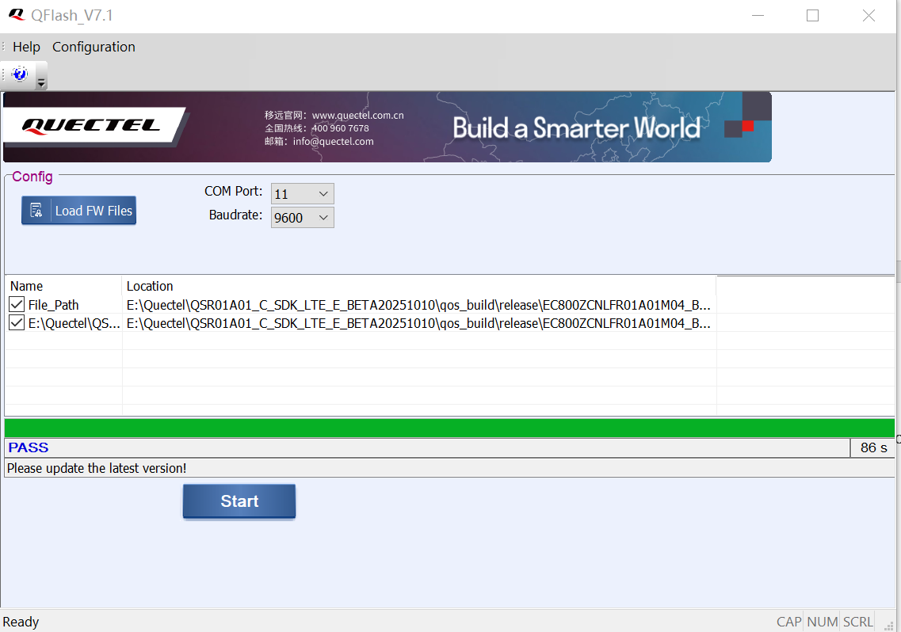

# QuecDuino 入门级传感器实验套件

### **产品介绍**

这是一款由EG800Z系列QuecDuino开发板与二十余种传感器及执行器深度融合打造的入门级实验套件。

QuecDuino入门级传感器实验套件，是专为初学者、创客及教育领域量身定制的一站式开发平台。它完美继承了Arduino开源硬件的易用基因，并创新性地集成了移远通信（Quectel）领先的蜂窝网络技术，让您的物联网构想摆脱繁琐配置，轻松照进现实。

**产品特点**

- **物联网开发**：不同于传统的 Arduino Uno，本套件内置网络通信能力，让你写的代码可以直接连接互联网，无需依赖电脑或额外的 WiFi 模块。
- **Python 上手零门槛**：利用 Python 语言的简洁性，让初学者能跳过复杂的寄存器配置，直接关注物联网逻辑和业务实现。
- **工业级稳定性**：采用移远通信 (Quectel) 工业级模组，适应 -35℃ 到 85℃ 的宽温工作环境，不仅适合学习，也适合工业原型验证。
- **传感器丰富**：多达数十种传感器外设供用户学习使用，丰富的硬件组合能完美还原真实的物联网开发需求。

### **案例清单**

| 序号 | 传感器                 | 案例                                                      |
| ---- | ---------------------- | --------------------------------------------------------- |
| 01   | LED灯模块              | example/01-LED灯/led.py                                   |
| 02   | 单按键模块             | example/02-按键中断/key_Extlnt.py                         |
| 03   | RGB 灯珠模块           | example/03-全彩LED/rgb_led.py                             |
| 04   | MIC模块                | example/04-麦克风(MIC)/MIC.py                             |
| 05   | 蜂鸣器模块             | example/05-蜂鸣器模块(buzzer)/Buzzer.py                   |
| 06   | 水位监测模块           | example/06-水位检测模块/water.py                          |
| 07   | 磁簧开关模块(KY-025)   | example/07-磁簧开关(KY-025)/adc.py                        |
| 08   | 障碍物检测模块(KY-032) | example/08-障碍物检测(KY-032)/obstacle_avoidance.py       |
| 09   | 迷你磁簧(KY-021)       | example/09-迷你磁簧(KY-021)/mini_Electromagnetics.py      |
| 10   | 光敏电阻模块(KY-018)   | example/10-光敏电阻模块(KY-018)/light.py                  |
| 11   | 火焰检测模块（KY-026） | example/11-火焰检测(KY-026）/flame.py                     |
| 12   | 魔术光环模块（KY-027） | example/12-魔术光环模块(KY-027)/mini_Electromagnetics.py  |
| 13   | 倾斜模块（KY-020）     | example/13-倾斜开关(KY-020)/Inclination_switch.py         |
| 14   | 超声波模块(HC-SR04)    | example/14-超声波模块(HC-SR04)/ultrasonic_gpio.py         |
| 15   | 人体触碰模块(KY-036)   | example/15-人体触碰模块(KY-036)/Finger_touch_detection.py |
| 16   | 数码管模块(JY005)      | example/16-数码管模块(JY005)/Display_LCD.py               |
| 17   | 激光发射模块(KY-008)   | example/17-激光发射器(KY-008)/Laser_emitter.py            |
| 18   | 水银开关模块(KY-017)   | example/18-水银开关(KY-017)/mercury_switch.py             |
| 19   | 温湿度传感器(AHT20)    | example/19-温湿度传感器(AHT20)/AHT20.py                   |

# EG800Z Duino 开发板固件烧录&使用指导

##  工具下载

请按照如下链接分别下载固件烧录工具和开发调试工具。

固件烧录工具：[QFlash](https://developer.quectel.com/wp-content/uploads/2024/09/QFlash_V7.4_CN.zip)

开发调试工具：[QPYcom](https://developer.quectel.com/wp-content/uploads/2024/09/QPYcom_V4.1.0.zip)

## 固件烧录指导

### 1. 打开 QFlash 程序，点击“**Load FW Files**” 导入固件文件

> !! 请从本仓库的 firmware 文件夹中，获取 QPY_OCPU_EG800Z_CNLA_FW.zip 并解压。



*图1：固件烧录-加载固件文件*

### 2. 选择烧录文件

选择固件包中的`at_command.hbinpkg`文件，点击确定后自动导入。



*图2：固件烧录-选择要下载的固件文件*

### 3. 设备固件下载模式

使用杜邦线短接 **BOOT** 引脚进入下载模式，打开设备管理器，重启设备，查看“端口 (COM 和 LPT)”中的 Quectel QDLoader Port，记录 COM 通道号。



*图3：固件烧录-记录COM通道号*

### 4. 开始下载固件

在 QFlash 中选择对应 COM 通道，点击“**Start**”开始下载，等待进度条完成并显示“**PASS**”。



*图4：固件烧录-“Start”按钮*

下载进程监控



*图5：固件烧录-单击“Start”按钮后自动开始固件升级*

下载完成



*图6：固件烧录-固件升级成功*

## 使用QPYCom 工具通过 REPL 口调试代码

> !! REPL全称为**Read-Eval-Print-Loop (交互式解释器)**，可以在REPL中进行 QuecPython 程序的调试，是 QPYCom 工具用于 QuecPython 平台提供的主要的开发调试方式。

运行 **QPYcom** 工具后，选择正确的串口（波特率无需指定）并打开，即可开始 Python 命令行交互。

- **Step1：进入交互页面**

进入交互页面首先需要打开USB交互口，注意不同平台交互口名称有差异

打开QPYcom工具，端口选择连接**Quectel USB REPL Port**，选择“交互”界面

- **Step2：打开串口**

点击“打开串口”按钮，在交互界面输入**print(‘hello world’)**，按回车后可以看到执行的结果信息

```none
>>> print('hello world')
hello world
```

