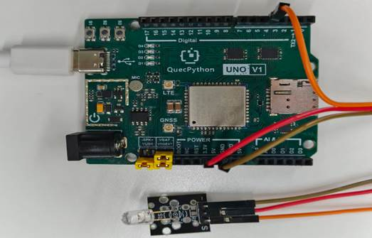

# LED模块

## **一、** **模块介绍**

LED原理及产业分类LED是发光二极体( Light EmitTIng Diode, LED)的简称，也被称作发光二极管，这种半导体组件发展以来一般是作为指示灯、显示板，但目前随着技术增加，已经能作为光源使用，它不但能够高效率地直接将电能转化为光能，而且拥有最长达数万小时～10 万小时的使用寿命，同时具备不若传统灯泡易碎，并能省电，同时拥有环保无汞、体积小、可应用在低温环境、光源具方向性、造成光害少与色域丰富等优点。

**LED组成：**


**发光原理：**


左为正极，右为负极。当正负极形成电压差时，LED点亮。

## 二、 连接示例

根据表格和图片指导，将外设与开发板一一对应连接

| 外设     | 开发板       |
| -------- | ------------ |
| LED（+） | 3.3V         |
| LED（-） | GND          |
| LED（S） | PIN4(GPIO31) |

 



## 三、 驱动代码

```python
from machine import Pin
import utime


class LED(object):
    """LED 驱动类，封装 GPIO 引脚对 LED 的基本操作。

    通过 active_level 参数适配不同硬件接法：
        - active_level=1：高电平点亮（默认，源极驱动 / 共阴极）
        - active_level=0：低电平点亮（漏极驱动 / 共阳极）

    Args:
        pin:  GPIO 引脚号，例如 Pin.GPIO31
        active_level: 点亮电平，1=高电平点亮，0=低电平点亮
    """

    def __init__(self, pin, active_level=1):
        self.active_level = active_level
        self.inactive_level = 0 if active_level else 1
        self.pin = Pin(pin, Pin.OUT, Pin.PULL_DISABLE, self.inactive_level)
        self.state = 0  # 0=灭, 1=亮（软件跟踪，与硬件电平解耦）

    def write(self, value):
        """设置 LED 的逻辑状态。

        Args:
            value: 1=点亮, 0=熄灭（与 active_level 无关的逻辑值）
        """
        self.state = value
        self.pin.write(self.active_level if value else self.inactive_level)

    def read(self):
        """读取 LED 当前的逻辑状态。

        Returns:
            int: 1=亮, 0=灭
        """
        return self.state

    def on(self):
        """点亮 LED。"""
        self.write(1)

    def off(self):
        """熄灭 LED。"""
        self.write(0)

    def toggle(self):
        """翻转 LED 状态（亮→灭，灭→亮）。"""
        self.write(0 if self.state else 1)

    def blink(self, interval=0.5, times=None):
        """LED 闪烁，以指定间隔循环亮灭。

        Args:
            interval: 亮灭单边持续时间，单位秒，默认 0.5s
            times:    闪烁次数（亮+灭=1次），None 表示无限循环
        """
        n = 0
        while times is None or n < times:
            self.on()
            utime.sleep(interval)
            self.off()
            utime.sleep(interval)
            n += 1


if __name__ == '__main__':
    led = LED(Pin.GPIO31, active_level=1)
    # 快闪 3 次后常亮
    led.blink(interval=0.3, times=3)
    led.on()
    print("LED 测试完成：3 次闪烁后常亮")
```

 