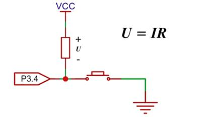
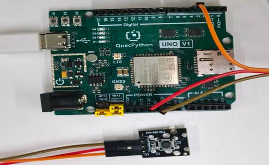

# 按键模块

## **一、** **模块介绍**

按键模块是**最基础的数字输入模块**，通过轻触开关实现通断控制，输出高低电平信号，用于实现**人机交互、开关控制、触发指令、计数、模式切换**等功能，是嵌入式 / 物联网项目必备模块。

**1、核心参数**

- 类型：轻触按键（机械式）
- 供电：3.3V–5V
- 输出：**数字信号（高 / 低电平）**
- 引脚：3 针（VCC、GND、SIG）
- 默认状态：**高电平（未按下）**
- 触发状态：**低电平（按下）**
- 自带：上拉电阻、信号指示灯

**2、原理图**



vcc和电阻都在芯片内部，当按键断开时，流过电阻的电流称为灌电流，大概几十毫安，因此此时引脚为高电平。按下时与地接通为低电平

## **二、** **连接示例**

根据表格和图片指导，将外设与开发板一一对应连接

| **外设**     | **模块**     |
| ------------ | ------------ |
| **KEY（+）** | 3.3V         |
| **KEY（-）** | GND          |
| **KEY（S）** | PIN4(GPIO31) |



## **三、** **驱动代码**

```python
import utime
from machine import ExtInt, Pin


class KeyInterrupt(object):
    """按键中断驱动类，基于外部中断实现按键检测、轮询与计数。

    支持两种使用模式：
        - 中断模式：注册回调，按键按下自动触发
        - 轮询模式：主动调用 read_state() / is_pressed()

    Args:
        pin:         GPIO 引脚号，例如 Pin.GPIO31
        mode:        中断触发模式，默认下降沿 (ExtInt.IRQ_FALLING)
        pull:        上下拉配置，默认上拉 (Pin.PULL_PU)
        filter_time: 硬件消抖时间，单位 ms，默认 50
        callback:    用户回调函数，签名 callback(args, count)
    """

    def __init__(self, pin, mode=ExtInt.IRQ_FALLING, pull=Pin.PULL_PU,
                 filter_time=50, callback=None):
        self._pin_obj = Pin(pin, Pin.IN, pull)
        self._press_count = 0
        self._callback = callback
        self._extint = ExtInt(pin, mode, pull, self._irq_handler, filter_time)

    def _irq_handler(self, args):
        """中断服务函数，在中断上下文中执行，不宜做耗时操作。"""
        self._press_count += 1
        if self._callback:
            self._callback(args, self._press_count)

    def set_callback(self, callback):
        """设置或替换用户回调函数。"""
        self._callback = callback

    def enable(self):
        """使能按键中断。"""
        self._extint.enable()

    def disable(self):
        """禁用按键中断。"""
        self._extint.disable()

    def read_state(self):
        """读取按键当前 GPIO 电平。

        Returns:
            int: 0=按下, 1=释放
        """
        return self._pin_obj.read()

    def is_pressed(self):
        """判断按键当前是否被按下。

        Returns:
            bool: True 表示按下
        """
        return self.read_state() == 0

    @property
    def count(self):
        """获取累计按下次数。"""
        return self._press_count

    def reset_count(self):
        """重置按键计数归零。"""
        self._press_count = 0

    def wait_for_press(self, timeout_ms=None):
        """阻塞等待按键按下，可选超时。

        Args:
            timeout_ms: 超时时间（ms），None 表示无限等待

        Returns:
            bool: True 表示按下，False 表示超时
        """
        start = utime.ticks_ms()
        while True:
            if self.is_pressed():
                return True
            if timeout_ms is not None:
                if utime.ticks_diff(utime.ticks_ms(), start) >= timeout_ms:
                    return False
            utime.sleep_ms(10)


def on_key_pressed(args, count):
    """示例回调函数，按键按下时打印中断参数和计数。"""
    print("[Callback] pressed, count = {}".format(count))


if __name__ == "__main__":
    key = KeyInterrupt(
        pin=Pin.GPIO31,
        mode=ExtInt.IRQ_FALLING,
        pull=Pin.PULL_PU,
        filter_time=50,
        callback=on_key_pressed,
    )
    key.enable()
    print("按键中断已启用，按下按键触发。")

    while True:
        utime.sleep_ms(500)
```

 