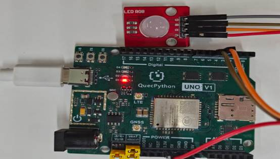

# LED Module

## 1. Module Introduction

The tricolor RGBLED is a **full-color light-emitting diode module**, which consists of three chips (red, green, and blue) packaged together. It can mix any color by adjusting brightness through PWM (Pulse Width Modulation), and is widely used in ambient lights, status indicators, interactive prompts, maker DIY scenarios. It can achieve effects such as seven-color gradient, breathing, and flashing, with advantages including small size, high brightness, 3.3V/5V compatibility, simple driving, and long service life.

**Light-emitting Principle**:

The LED pins share a common ground. The LED lights up when a voltage difference is formed between the positive and negative poles, so a high level turns on the LED.

## 2. Connection Example

Connect the peripheral to the development board one by one according to the guidance of the table and picture.

| Peripheral | Development Board |
| ---------- | ----------------- |
| LED（-）   | GND               |
| LED（R）   | PIN4（GPIO31）    |
| LED（G）   | PIN5（GPIO30）    |
| LED（B）   | PIN6（GPIO32）    |



## 3.Driver Code

```python
from machine import Pin
import utime


class RGBLED(object):
    def __init__(self, red, green, blue):
        self.red = red
        self.green = green
        self.blue = blue

    def set_color(self, red, green, blue):
        self.red.write(red)
        self.green.write(green)
        self.blue.write(blue)

    def set_color_by_name(self, name):
        color_map = {
            "red": (0, 1, 1),
            "green": (1, 0, 1),
            "blue": (1, 1, 0),
            "yellow": (0, 0, 1),
            "purple": (0, 1, 0),
            "cyan": (1, 0, 0),
            "white": (0, 0, 0),
            "off": (1, 1, 1)
        }
        if name in color_map:
            self.set_color(*color_map[name])

if __name__ == "__main__":
    # Modify according to the actual pins of your development board, such as Pin.GPIO31, Pin.GPIO30, and Pin.GPIO29
    rgb_led = RGBLED(
        red=Pin(Pin.GPIO32, Pin.OUT, Pin.PULL_DISABLE, 0),
        green=Pin(Pin.GPIO30, Pin.OUT, Pin.PULL_DISABLE, 0),
        blue=Pin(Pin.GPIO31, Pin.OUT, Pin.PULL_DISABLE, 0)
    )

    colors = ["red", "green", "blue", "yellow", "purple", "cyan", "white", "off"]
    while True:
        for color in colors:
            rgb_led.set_color_by_name(color)
            print("LED color set to {}".format(color))
            utime.sleep(1)
```

