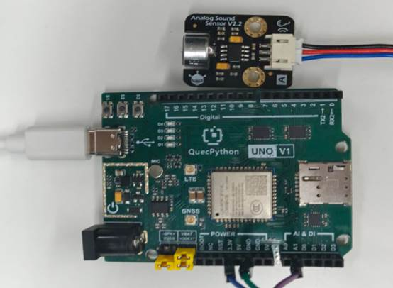

# Microphone Module

## 1. Module Introduction

A microphone is short for an **acoustic-electric conversion device**, also known as a sound detection sensor module. It can detect the sound intensity in the surrounding environment and convert it into an electrical signal for output. It contains a built-in microphone that can capture sound signals. The sensitivity of the module to sound can be adjusted by tuning the sensitivity potentiometer on the module. It supports analog output mode, meeting the requirements of most applications and design needs.

## 2. Connection Example

Connect the peripheral to the development board one-to-one according to the guidance of the table and picture.

| Peripheral | Development Board |
| ---------- | ----------------- |
| MIC（+）   | 3.3V              |
| MIC（-）   | GND               |
| MIC（S）   | A1(ADC1)          |

 


## 3.Driver Code

```python
from misc import ADC
from machine import Pin
import _thread
import utime


class Mic(object):
    """Microphone sensor class, reads sound intensity via ADC, lights LED when threshold is exceeded."""

    def __init__(self, adc_channel=None, led_pin=Pin.GPIO31, threshold=200, sample_ms=500, led_on_sec=2):
        """Initialize microphone instance.

        Args:
            adc_channel: ADC channel, defaults to ADC1
            led_pin: LED indicator GPIO pin number, defaults to GPIO31
            threshold: Sound intensity threshold to trigger LED, defaults to 200
            sample_ms: Sampling interval in milliseconds, defaults to 500ms
            led_on_sec: LED on duration in seconds, defaults to 2s
        """
        self.threshold = threshold
        self.sample_ms = sample_ms
        self.led_on_sec = led_on_sec
        self.led = Pin(led_pin, Pin.OUT, Pin.PULL_DISABLE, 0)
        self.adc = ADC()
        self.adc_channel = self.adc.ADC1 if adc_channel is None else adc_channel
        self.is_running = False

    def open(self):
        """Open ADC channel."""
        self.adc.open()

    def read_value(self):
        """Read current sound intensity ADC value."""
        return self.adc.read(self.adc_channel)

    def handle_sound(self, value):
        """Handle sound detection, light LED when threshold is exceeded.

        Note: Blocks the current thread for led_on_sec seconds while LED is on.
        """
        if value > self.threshold:
            self.led.write(1)
            utime.sleep(self.led_on_sec)
            self.led.write(0)

    def monitor(self):
        """Background monitoring loop, continuously samples and handles sound events."""
        self.is_running = True
        while self.is_running:
            value = self.read_value()
            print(value)
            self.handle_sound(value)
            utime.sleep_ms(self.sample_ms)

    def start(self):
        """Start background sampling thread."""
        self.open()
        _thread.start_new_thread(self.monitor, ())

    def stop(self):
        """Stop background sampling thread."""
        self.is_running = False


if __name__ == '__main__':
    mic = Mic(
        led_pin=Pin.GPIO31,
        threshold=200,
        sample_ms=500,
        led_on_sec=2,
    )
    mic.start()

    # Keep main thread alive
    while True:
        utime.sleep_ms(1000)
```

 