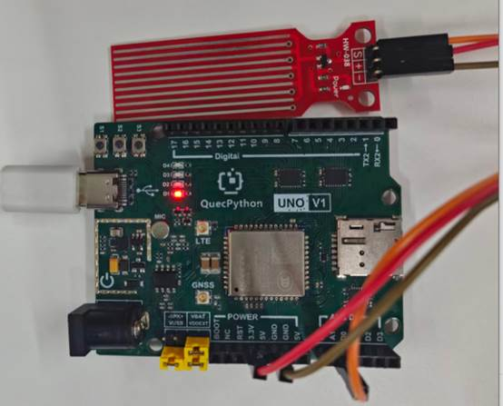

# 水位检测模块

## **一、** **模块介绍**

水位监测模块是**电阻式液体检测传感器**，用于检测水位高度、有无水、漏水报警等场景；通过导电探针检测液面变化，输出模拟，具备**响应快、体积小、3.3V兼容、直接接 ADC、使用寿命长**等优点。

**工作原理：**

Water Sensor水位传感器能够监测水位。该模块主要是利用三极管的电流放大原理：当液位高度使三极管的基极与电源正极导通的时候，在三极管的基极和发射极之间就会产生一定大小的电流，此时在三极管的集电极和发射极之间就会产生一个一定放大倍数的电流，该电流经过发射极的电阻产生特点电压，被AD转换器采集。

## 二、 连接示例

根据表格和图片指导，将外设与开发板一一对应连接

| 外设      | 开发板     |
| --------- | ---------- |
| 模块（+） | 3.3V       |
| 模块（-） | GND        |
| 模块（S） | A1（ADC1） |



## 三、 驱动代码

```python
from misc import ADC
import _thread
import utime

class WaterLevelSensor:
    """Water level sensor packaging type"""

    def __init__(self, adc_channel=None, ref_voltage=3300, max_water_level=60, sample_count=10, sample_interval_ms=5):
        self.adc = ADC()
        self.adc_channel = self.adc.ADC1 if adc_channel is None else adc_channel
        self.ref_voltage = ref_voltage
        self.max_water_level = max_water_level
        self.sample_count = sample_count
        self.sample_interval_ms = sample_interval_ms
        self.is_running = False

    def open(self):
        self.adc.open()
    def read_voltage(self):
        adc_sum = 0
        for _ in range(self.sample_count):
            adc_sum += self.adc.read(self.adc_channel)
            utime.sleep_ms(self.sample_interval_ms)
        return adc_sum / self.sample_count

    def read_level(self):
        voltage_avg = self.read_voltage()
        water_level = (voltage_avg / self.ref_voltage) * self.max_water_level
        return voltage_avg, round(water_level, 2)

    def monitor(self, interval_sec=1):
        self.is_running = True
        while self.is_running:
            voltage, level = self.read_level()
            print("Voltage: {:.1f} mV | Water Level: {:.2f} mm".format(voltage, level))
            utime.sleep(interval_sec)

    def start(self, interval_sec=1):
        self.open()
        _thread.start_new_thread(self.monitor, (interval_sec,))

    def stop(self):
        self.is_running = False


if __name__ == '__main__':
    water_sensor = WaterLevelSensor(
        ref_voltage=3300,
        max_water_level=60,
        sample_count=10,
        sample_interval_ms=5,
    )
    water_sensor.start(interval_sec=1)

    while True:
        utime.sleep_ms(1000)
```

 