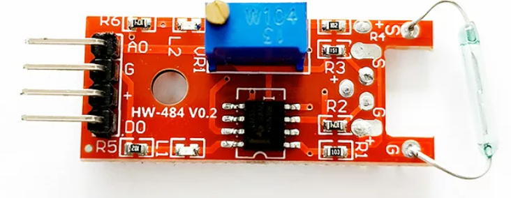

# KY-025 磁簧开关（干簧管）传感器模块介绍

KY-025是一款基于**磁簧开关（Reed Switch，又称干簧管）**原理的磁控传感器模块。它本质上是一个受磁场控制的微型电气开关，当有磁铁靠近时，内部的金属簧片会吸合导通电路；当磁铁远离时，簧片会自动弹开断开电路。

由于其结构简单、灵敏度高且无需直接接触即可触发，KY-025常被用于各种物联网项目中作为非接触式的接近检测或位置限位装置。



## 核心特点

- **双重信号输出**：模块同时提供数字量（DO）和模拟量（AO）两种输出接口，既能做简单的开关判断，也能感知磁场强度的相对变化。
- **灵敏度可调**：板载精密电位器（微调旋钮），可以根据实际应用场景旋转调节传感器的探测距离和触发灵敏度。
- **直观的工作指示**：配有电源指示灯和工作状态LED，当检测到磁场触发时，板载LED会亮起，方便调试与观察。
- **宽电压兼容**：通常支持3.3V至5V的宽电压供电，能够完美适配Arduino、STM32以及你手中的QuecDuino等各类主流单片机开发板。

## **引脚说明与接线**

KY-025模块通常引出4个标准引脚，具体的定义如下：

| 引脚名称    | 功能说明     | 接线建议                      |
| :---------- | :----------- | :---------------------------- |
| **+ (VCC)** | 电源正极     | 接开发板的 3.3V 或 5V         |
| **G (GND)** | 电源负极     | 接开发板的 GND                |
| **D0**      | 数字信号输出 | 接开发板的普通GPIO（如引脚4） |
| **A0**      | 模拟信号输出 | 接开发板的ADC引脚（如A0）     |

## 工作原理详解

1. **数字输出（D0）**：这是一个开关量信号。当你调节好灵敏度后，一旦有磁铁进入有效探测范围，引脚4会输出高电平（或低电平，视具体电路设计而定），同时板载LED点亮；磁铁移开后恢复原状。这非常适合用来制作“门磁报警”或“到位检测”。
2. **模拟输出（A0）**：该引脚输出的电压值会随着磁场强度的变化而线性改变。通常情况下，没有磁场时输出较高数值，随着磁铁逐渐靠近，输出电压会逐渐降低。通过读取这个模拟值，你可以大致判断出磁铁与传感器之间的距离远近。

##  常见应用场景

- **门窗防盗报警**：将模块安装在门框，磁铁安装在门扇上，开门即触发警报。
- **智能计数与测速**：在风扇叶片或旋转物体上安装磁铁，每转一圈触发一次，从而计算转速或累计次数。
- **位置限位检测**：在机械臂或移动小车上，用于检测是否到达了预设的物理边界。
- **无触点开关**：作为珠宝盒、礼品盒的开盖亮灯触发器，既隐蔽又耐用。

## 驱动代码

### ADC 模式（模拟量读取磁场强度）

```python
from misc import ADC
from machine import Pin
import _thread
import utime


class MagneticReedSwitch(object):
    """磁簧开关传感器类（ADC 模式），通过模拟量读取磁场强度变化。

    应用场景：门窗防盗、智能计数、位置限位检测、无触点开关等。
    当 ADC 值超过阈值时判定为检测到磁场，点亮 LED 指示。
    """

    def __init__(self, adc_channel=None, led_pin=Pin.GPIO31, threshold=100):
        """初始化磁簧开关传感器实例（ADC 模式）。

        Args:
            adc_channel: ADC 通道，默认使用 ADC1
            led_pin: LED 指示灯 GPIO 引脚号，默认 GPIO31
            threshold: 磁场强度阈值，默认 100
        """
        self.threshold = threshold
        self.led = Pin(led_pin, Pin.OUT, Pin.PULL_DISABLE, 0)
        self.adc = ADC()
        self.adc_channel = self.adc.ADC1 if adc_channel is None else adc_channel
        self.is_running = False

    def open(self):
        """打开 ADC 通道。"""
        self.adc.open()

    def read_value(self):
        """读取当前磁场强度的 ADC 值。"""
        return self.adc.read(self.adc_channel)

    def handle_magnetic_field(self, value):
        """根据磁场强度控制 LED 指示。"""
        if value > self.threshold:
            self.led.write(1)
        else:
            self.led.write(0)

    def monitor(self):
        """后台监控循环，持续采样并输出磁场状态。"""
        self.is_running = True
        while self.is_running:
            value = self.read_value()
            status = "检测到磁场" if value > self.threshold else "无磁场"
            print("ADC: {} | 状态: {}".format(value, status))
            self.handle_magnetic_field(value)
            utime.sleep_ms(500)

    def start(self):
        """启动后台采样线程。"""
        self.open()
        _thread.start_new_thread(self.monitor, ())

    def stop(self):
        """停止后台采样线程。"""
        self.is_running = False


if __name__ == '__main__':
    magnetic_reed_switch = MagneticReedSwitch(
        led_pin=Pin.GPIO31,
        threshold=100,
    )
    magnetic_reed_switch.start()

    # 主线程保持运行，等待后台监控
    while True:
        utime.sleep_ms(1000)
```

### GPIO 模式（数字量检测开关状态）

```python
from machine import Pin
import utime


class ReedSwitch(object):
    """磁簧开关传感器类（GPIO 模式），通过数字量检测磁场状态变化。

    应用场景：门窗防盗报警、液位浮子开关、设备到位检测等。
    常见接线为上拉输入，磁铁靠近时输出低电平（触发）。
    """

    def __init__(self, pin=Pin.GPIO31, trigger_level=0, pull=Pin.PULL_PU):
        """初始化磁簧开关传感器实例（GPIO 模式）。

        Args:
            pin: GPIO 引脚号，默认 GPIO31
            trigger_level: 触发电平，0 = 低电平触发，1 = 高电平触发，默认 0
            pull: 上下拉配置，默认上拉 (Pin.PULL_PU)
        """
        self.gpio = Pin(pin, Pin.IN, pull)
        self.trigger_level = trigger_level
        self.last_state = self.gpio.read()

    def read_state(self):
        """读取当前 GPIO 电平状态。"""
        return self.gpio.read()

    def is_triggered(self):
        """判断当前是否处于触发状态。"""
        return self.read_state() == self.trigger_level

    def check_state_change(self):
        """检测状态是否发生变化。

        实际应用场景：门磁防盗——开门触发报警，关门恢复正常。
        """
        current = self.read_state()
        changed = current != self.last_state
        self.last_state = current
        return changed, current

    def monitor(self, interval_sec=1):
        """轮询监控循环，检测并输出磁场状态变化。"""
        while True:
            changed, state = self.check_state_change()

            if changed:
                if state == self.trigger_level:
                    print("[ReedSwitch] 触发：检测到磁场变化")
                else:
                    print("[ReedSwitch] 释放：磁场恢复正常")
            else:
                print("[ReedSwitch] 稳定：状态未变化")

            utime.sleep(interval_sec)


if __name__ == "__main__":
    # 默认上拉输入，低电平触发
    sensor = ReedSwitch(pin=Pin.GPIO31, trigger_level=0, pull=Pin.PULL_PU)
    sensor.monitor(interval_sec=1)
```

