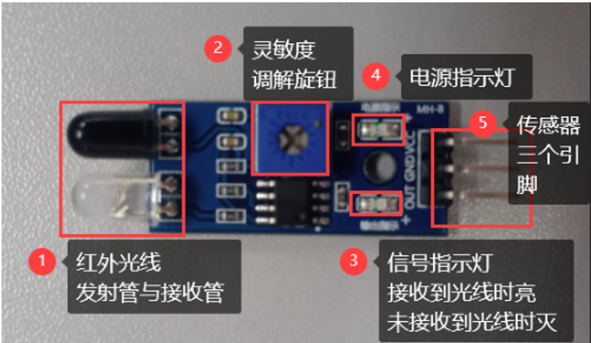
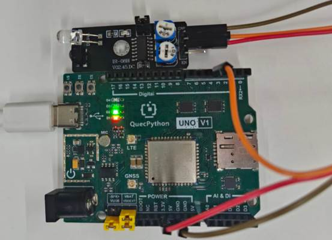

# Obstacle Detection Module

## 1. Module Introduction

The obstacle detection module is an infrared reflective digital detection device, also known as an infrared obstacle avoidance module, which is used for short-distance obstacle detection, tracking, obstacle avoidance, and limit triggering; it judges whether there is an obstacle in front through infrared emission and reception, with advantages such as fast response, small size, 3.3V/5V compatibility, direct GPIO reading, strong anti-interference, and long service life.

**Module Composition:**



**Working Principle:**

The working principle is that the infrared light emitting tube **emits infrared light**, and the infrared light receiving tube **receives infrared light**. When **no reflected infrared light is received**, the OUT pin outputs **high level**; when **reflected infrared light is received**, the OUT pin outputs **low level**.

## 2. Connection Example

Connect the peripherals to the development board one by one according to the table and picture instructions

| Peripheral  | Development Board |
| ----------- | ----------------- |
| Module（+） | 3.3V              |
| Module（-） | GND               |
| Module（S） | PIN4(GPIO31)      |



## 3.Driver Code

```python
from machine import Pin, ExtInt
import utime


class ObstacleSensor(object):
    """Infrared obstacle avoidance sensor class (KY-032), supports polling and interrupt modes.

    Sensor output logic:
        - No obstacle: OUT outputs high level (1)
        - Obstacle detected: OUT outputs low level (0)

    Application scenarios: robot obstacle avoidance, auto door sensing, limit detection, smart trash can, etc.
    """

    def __init__(self, pin=Pin.GPIO31, pull=Pin.PULL_PU):
        """Initialize obstacle sensor instance.

        Args:
            pin: GPIO pin number, defaults to GPIO31
            pull: Pull-up/down config, defaults to pull-up (Pin.PULL_PU)
        """
        self.gpio = Pin(pin, Pin.IN, pull)
        self.obstacle_flag = False
        self._extint = None

    def read_state(self):
        """Read current sensor state."""
        return self.gpio.read()

    def is_obstacle(self):
        """Check if obstacle is currently detected."""
        return self.read_state() == 0

    def _irq_handler(self, args):
        """Interrupt callback, sets flag when obstacle detected."""
        if self.gpio.read() == 0:
            self.obstacle_flag = True

    def monitor_polling(self, interval_ms=200):
        """Polling mode: continuously reads sensor state.

        Suitable for scenarios with low real-time requirements, such as limit detection.
        """
        print("[ObstacleSensor] Polling mode started")
        while True:
            if self.is_obstacle():
                print("Obstacle detected")
            else:
                print("No obstacle")
            utime.sleep_ms(interval_ms)

    def monitor_interrupt(self, interval_ms=200):
        """Interrupt mode: obstacle triggers interrupt, main loop checks flag.

        Suitable for fast-response scenarios, such as robot obstacle avoidance.
        """
        self._extint = ExtInt(self.gpio, ExtInt.IRQ_FALLING, Pin.PULL_PU, self._irq_handler)
        self._extint.enable()
        print("[ObstacleSensor] Interrupt mode started")
        while True:
            if self.obstacle_flag:
                print("Obstacle detected")
                self.obstacle_flag = False
            else:
                print("No obstacle")
            utime.sleep_ms(interval_ms)


if __name__ == '__main__':
    sensor = ObstacleSensor(pin=Pin.GPIO31)

    # Polling mode
    sensor.monitor_polling(interval_ms=200)

    # Interrupt mode (uncomment to switch)
    # sensor.monitor_interrupt(interval_ms=200)
```

 