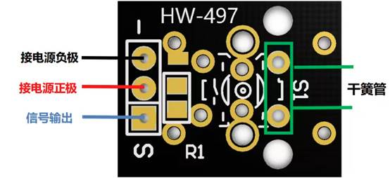
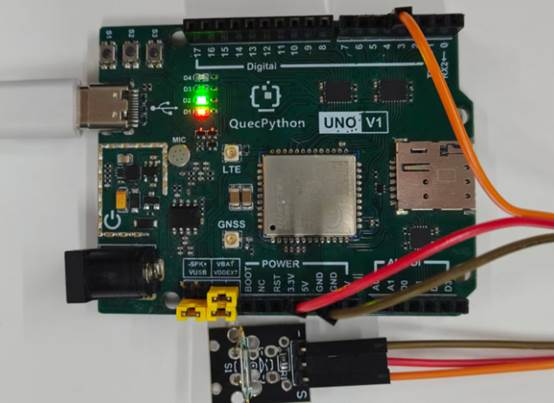

# Mini Reed Module

## 1. Module Introduction

The mini reed, full name **Mini Reed Switch (Reed Pipe Module)**, is a passive switch component whose on-off is controlled by a magnetic field. This type of magnetic induction device is generally used for door magnetic detection, position detection, and limit triggering, and is currently widely used in embedded devices, smart hardware, and maker DIY scenarios; it can conduct when a magnetic field approaches and disconnect when the magnetic field moves away, with advantages such as small size, fast response, no mechanical contact wear, low power consumption, plug-and-play, adaptation to 3.3V/5V low-voltage environment, direct connection to GPIO detection, and long service life.

Composition of Mini Reed Module:



**Working Principle:**

The module is essentially a switch controlled by a magnetic field. When a magnet approaches the module, the reed in the glass tube is magnetized and attracted to each other to contact, and the circuit is conducted; when the magnet moves away, the reed loses its magnetism and separates by elasticity, and the circuit is disconnected, so as to realize the switch signal output triggered by the magnetic field.

## 2. Connection Example

Connect the peripherals to the development board one by one according to the table and picture instructions

| Peripheral  | Development Board |
| ----------- | ----------------- |
| Module（+） | 3.3V              |
| Module（-） | GND               |
| Module（S） | PIN4(GPIO31)      |



## 3.Driver Code

```python
from machine import Pin
import utime


class MiniMagneticController(object):
    """Mini magnetic sensor control class, magnetic field detection + output linkage.

    Application scenarios: door magnet triggers output linkage, driving warning lights, buzzers or relays.
    """

    def __init__(
        self,
        sensor_pin=Pin.GPIO31,
        output_pin=Pin.GPIO30,
        trigger_level=0,
        output_active_level=1,
    ):
        """Initialize magnetic sensor controller.

        Args:
            sensor_pin: Sensor input GPIO pin number, defaults to GPIO31
            output_pin: Linkage output GPIO pin number, defaults to GPIO30
            trigger_level: Trigger level, 0 = low level trigger, 1 = high level trigger, defaults to 0
            output_active_level: Output active level, defaults to 1 (high level active)
        """
        self.sensor = Pin(sensor_pin, Pin.IN, Pin.PULL_PU)
        self.output = Pin(output_pin, Pin.OUT, Pin.PULL_DISABLE, 0)
        self.trigger_level = trigger_level
        self.output_active_level = output_active_level
        self.output_inactive_level = 0 if output_active_level else 1
        self.last_state = self.sensor.read()

    def read_sensor(self):
        """Read current sensor level state."""
        return self.sensor.read()

    def is_triggered(self):
        """Check if currently in triggered state."""
        return self.read_sensor() == self.trigger_level

    def set_output(self, active):
        """Control linkage output pin level, can drive LED, buzzer, relay, etc."""
        level = self.output_active_level if active else self.output_inactive_level
        self.output.write(level)

    def update(self):
        """Update linkage output based on sensor state and return state change info."""
        state = self.read_sensor()
        triggered = state == self.trigger_level
        self.set_output(triggered)

        if triggered:
            print("Magnetic field change detected")
        else:
            print("No magnetic field change detected")

        changed = state != self.last_state
        self.last_state = state
        return changed, triggered

    def monitor(self, interval_sec=1):
        """Polling monitor loop, detects magnetic field state and controls output linkage.

        Application scenarios: access control status indication and intrusion detection, etc.
        """
        while True:
            changed, triggered = self.update()
            if changed:
                if triggered:
                    print("[MiniMagnetic] Trigger event")
                else:
                    print("[MiniMagnetic] Release event")
            utime.sleep(interval_sec)


if __name__ == '__main__':
    controller = MiniMagneticController(
        sensor_pin=Pin.GPIO31,
        output_pin=Pin.GPIO30,
        trigger_level=0,
        output_active_level=1,
    )
    controller.monitor()
```
