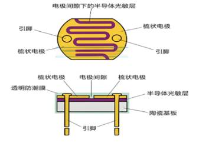
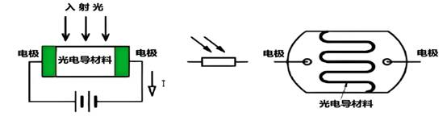
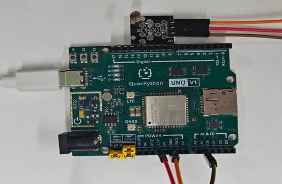

# Photosensitive Resistor Module

## 1. Module Introduction

The photosensitive resistor sensor is a type of sensor that can convert optical signals into electrical signals, and its resistance value changes with the intensity of light. In many practical applications, such as automatic lighting systems, ambient light detection, etc., the photosensitive resistor sensor plays an important role. The EG800Z Duino development board is equipped with rich peripheral resources, which can be easily combined with the photosensitive resistor sensor to realize the detection and processing of light intensity.

Photosensitive resistors are usually made of semiconductor materials, and their working principle is based on the internal photoelectric effect. When light irradiates the photosensitive resistor, electrons in the semiconductor material absorb the energy of photons and transition from the valence band to the conduction band, thereby enhancing the conductivity of the material and reducing the resistance value. Conversely, when the light intensity weakens, the resistance value increases.

The characteristic curve of a photosensitive resistor usually shows a non-linear relationship, that is, the relationship between light intensity and resistance value is not a simple linear proportional relationship. In practical applications, calibration and processing need to be carried out according to specific requirements and characteristic curves.

**Composition of Photosensitive Resistor:**



Working Principle:



**The stronger the light, the smaller the resistance and the lower the voltage; the weaker the light, the larger the resistance and the higher the voltage.**

## 2. Connection Example

Connect the peripherals to the development board one by one according to the table and picture instructions

| Peripheral | Development Board |
| ---------- | ----------------- |
| LDR（+）   | 3.3V              |
| LDR（-）   | GND               |
| LDR（S）   | A1（ADC1）        |



## 3.Driving Code

```python
from misc import ADC
from machine import Pin
import _thread
import utime


class LightController(object):
    """Photoresistor controller class, reads light intensity via ADC and controls LED.

    Sensor characteristic: stronger light = lower resistance = lower ADC value; weaker light = higher ADC value.
    Application scenarios: automatic street light, smart lighting, ambient light detection, etc.
    """

    def __init__(self, adc_channel=None, led_pin=Pin.GPIO31, sample_ms=500):
        """Initialize photoresistor controller.

        Args:
            adc_channel: ADC channel, defaults to ADC1
            led_pin: LED indicator GPIO pin number, defaults to GPIO31
            sample_ms: Sampling interval in milliseconds, defaults to 500ms
        """
        self.sample_ms = sample_ms
        self.led = Pin(led_pin, Pin.OUT, Pin.PULL_DISABLE, 0)
        self.adc = ADC()
        self.adc_channel = self.adc.ADC1 if adc_channel is None else adc_channel
        self.is_running = False

    def start(self):
        """Start ADC and launch background monitoring thread."""
        self.adc.open()
        self.is_running = True
        _thread.start_new_thread(self.monitor, ())

    def monitor(self):
        """Background monitoring loop, reads light intensity and controls LED based on threshold.

        Note: Current logic is for demo purposes (weak light → LED off, strong light → LED on).
        For a real automatic street light scenario, reverse the logic: weak light → LED on, strong light → LED off.
        """
        while self.is_running:
            light_value = self.adc.read(self.adc_channel)
            print("Light intensity value: {}".format(light_value))
            if light_value < 50:
                self.led.write(0)
                print("Light is weak, turn off LED")
            else:
                self.led.write(1)
                print("Light is strong, turn on LED")
            utime.sleep_ms(self.sample_ms)

    def stop(self):
        """Stop background monitoring thread."""
        self.is_running = False


if __name__ == '__main__':
    light_controller = LightController(
        led_pin=Pin.GPIO31,
        sample_ms=500,
    )
    light_controller.start()

    # Keep main thread alive
    while True:
        utime.sleep_ms(1000)
```

