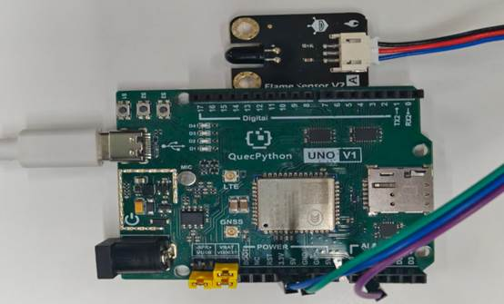

# 火焰检测模块

## **一、** **模块介绍**

火焰检测模块是用于**探测火焰 / 明火**的传感器模块，通过接收火焰产生的红外光，输出高低电平信号，实现火灾报警、火源检测。

**核心参数**

- 工作电压：3.3V–5V
- 输出：数字信号（无高 /有低）
- 输出：模拟信号（近高 / 远低）
- 检测角度：约 60°
- 接口：**MX1.25-2P**
- 用途：火焰检测、火灾报警、火源判断

## 二、连接示例

根据表格和图片指导，将外设与开发板一一对应连接

| 外设         | 开发板                   |
| ------------ | ------------------------ |
| Flame（+）   | 3.3V                     |
| Flame（-）   | GND                      |
| Flame（A/D） | A1（ADC1）/ PIN4(GPIO31) |



## 三、 驱动代码

### 模拟信号（ADC 模式）

```python
from misc import ADC
from machine import Pin
import _thread
import utime


class FlameSensor(object):
    """火焰传感器类（ADC 模式），通过模拟量读取火焰强度并分级报警。

    分级逻辑：
        LEVEL_SAFE  (0): 安全
        LEVEL_WARN  (1): 火险隐患，LED 常亮
        LEVEL_ALERT (2): 火灾报警，LED 快闪

    Args:
        adc_channel:     ADC 通道，默认 ADC0
        led_pin:         LED 报警 GPIO，默认 GPIO31，传 None 禁用
        warn_threshold:  火险隐患阈值，默认 100
        alert_threshold: 火灾报警阈值，默认 500
    """

    LEVEL_SAFE = 0
    LEVEL_WARN = 1
    LEVEL_ALERT = 2

    def __init__(self, adc_channel=None, led_pin=Pin.GPIO31,
                 warn_threshold=100, alert_threshold=500):
        self._warn_threshold = warn_threshold
        self._alert_threshold = alert_threshold
        self._led = None
        if led_pin is not None:
            self._led = Pin(led_pin, Pin.OUT, Pin.PULL_DISABLE, 0)
        self._adc = ADC()
        self._adc_channel = self._adc.ADC0 if adc_channel is None else adc_channel
        self._callback = None
        self._is_running = False
        self._last_value = 0
        self._last_level = self.LEVEL_SAFE

    def set_callback(self, callback):
        """设置火焰检测回调。callback(adc_value, level)"""
        self._callback = callback

    def read_value(self):
        """读取当前火焰强度 ADC 值。"""
        self._last_value = self._adc.read(self._adc_channel)
        return self._last_value

    def check_level(self, value):
        """根据 ADC 值判断报警等级。"""
        if value < self._warn_threshold:
            return self.LEVEL_SAFE
        elif value < self._alert_threshold:
            return self.LEVEL_WARN
        else:
            return self.LEVEL_ALERT

    def _update_led(self, level):
        if self._led is None:
            return
        if level == self.LEVEL_SAFE:
            self._led.write(0)
        elif level == self.LEVEL_WARN:
            self._led.write(1)

    def _monitor(self):
        """后台监控循环，根据火焰强度分级响应。"""
        blink_state = 0
        last_blink = 0
        while self._is_running:
            value = self.read_value()
            level = self.check_level(value)
            self._last_level = level
            print("ADC: {} | 状态: {}".format(value,
                "安全" if level == 0 else "火险隐患" if level == 1 else "火灾报警"))

            if level == self.LEVEL_ALERT:
                now = utime.ticks_ms()
                if utime.ticks_diff(now, last_blink) >= 250:
                    blink_state = 0 if blink_state else 1
                    if self._led:
                        self._led.write(blink_state)
                    last_blink = now
            else:
                self._update_led(level)

            if self._callback:
                self._callback(value, level)
            utime.sleep_ms(200)

    def start(self):
        """启动 ADC 并开启后台监控线程。"""
        self._adc.open()
        self._is_running = True
        _thread.start_new_thread(self._monitor, ())

    def stop(self):
        """停止后台监控线程并关闭 LED。"""
        self._is_running = False
        if self._led is not None:
            self._led.write(0)


if __name__ == '__main__':
    sensor = FlameSensor()
    sensor.set_callback(lambda v, l: print("!!!" if l == 2 else ""))
    sensor.start()

    while True:
        utime.sleep_ms(1000)
```

### 数字信号（GPIO 模式）

```python
from machine import Pin
import utime


class FlameDigitalSensor(object):
    """火焰传感器类（GPIO 模式），通过数字量检测火焰并联动输出。

    Args:
        sensor_pin:    传感器输入 GPIO，默认 GPIO31
        output_pin:    联动输出 GPIO，默认 GPIO30，传 None 禁用
        trigger_level: 1=高电平触发，0=低电平触发，默认 1
    """

    def __init__(self, sensor_pin=Pin.GPIO31, output_pin=Pin.GPIO30, trigger_level=1):
        self._sensor = Pin(sensor_pin, Pin.IN, Pin.PULL_PD)
        self._output = None
        if output_pin is not None:
            self._output = Pin(output_pin, Pin.OUT, Pin.PULL_DISABLE, 0)
        self._trigger_level = trigger_level
        self._last_state = self._sensor.read()
        self._callback = None
        self._trigger_count = 0

    def set_callback(self, callback):
        """设置火焰检测回调。callback(is_detected)"""
        self._callback = callback

    def read_state(self):
        """读取传感器当前电平状态。"""
        return self._sensor.read()

    def is_flame_detected(self):
        """判断当前是否检测到火焰。"""
        return self.read_state() == self._trigger_level

    def set_output(self, active):
        """控制联动输出引脚。"""
        if self._output is not None:
            self._output.write(1 if active else 0)

    @property
    def trigger_count(self):
        """获取累计触发次数。"""
        return self._trigger_count

    def reset_count(self):
        """重置触发计数归零。"""
        self._trigger_count = 0

    def _check_state(self):
        """检测状态变化，更新联动输出。"""
        state = self.read_state()
        detected = state == self._trigger_level
        self.set_output(detected)
        changed = state != self._last_state
        if changed and detected:
            self._trigger_count += 1
            if self._callback:
                self._callback(True)
        elif changed and not detected:
            if self._callback:
                self._callback(False)
        self._last_state = state
        return changed, detected

    def monitor(self, interval_ms=100):
        """轮询监控循环。

        Args:
            interval_ms: 轮询间隔 ms，默认 100
        """
        while True:
            changed, detected = self._check_state()
            if changed:
                if detected:
                    print("检测到火焰")
                else:
                    print("火焰消失")
            utime.sleep_ms(interval_ms)


if __name__ == "__main__":
    sensor = FlameDigitalSensor(sensor_pin=Pin.GPIO31, output_pin=Pin.GPIO30, trigger_level=1)
    sensor.monitor()
```

``    

 