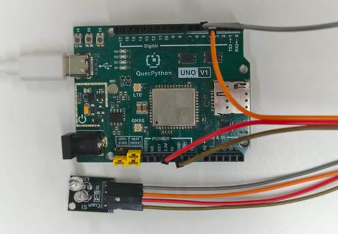

# 魔术光环模块

## **一、** **模块介绍**

魔术光环模块（KY‑027）是**倾斜感应 + LED 发光**二合一数字模块，内置水银开关与高亮 LED，用于倾斜检测、姿态触发、状态指示、创客互动项目；模块体积小、响应快、数字电平输出、3.3V/5V 兼容、直接接 GPIO 驱动、寿命稳定。

**工作原理：**


模块有供电、接地、信号输出、LED 控制端。倾斜到一定角度时，水银开关导通 / 断开，输出高低电平；可通过 GPIO 控制 LED 亮灭，实现倾斜亮灯、姿态报警等效果。

## 二、 连接示例

根据表格和图片指导，将外设与开发板一一对应连接

| 外设          | 开发板       |
| ------------- | ------------ |
| 魔术光环（+） | 3.3V         |
| 魔术光环（-） | GND          |
| 魔术光环（S） | PIN4(GPIO31) |
| 魔术光环（L） | PIN5(GPIO30) |



## 三、 驱动代码

```python
from machine import Pin
import utime


class TiltSwitch(object):
    """倾斜开关传感器类，检测设备姿态并联动输出。

    应用场景：倾覆报警、设备姿态检测、运输振动/偏转指示等。
    """

    def __init__(self, sensor_pin=Pin.GPIO31, output_pin=Pin.GPIO30, trigger_level=1):
        """初始化倾斜开关传感器实例。

        Args:
            sensor_pin: 传感器输入 GPIO 引脚号，默认 GPIO31
            output_pin: 联动输出 GPIO 引脚号，默认 GPIO30
            trigger_level: 触发电平，默认 1（高电平触发）
        """
        self.sensor = Pin(sensor_pin, Pin.IN, Pin.PULL_PD)
        self.output = Pin(output_pin, Pin.OUT, Pin.PULL_DISABLE, 0)
        self.trigger_level = trigger_level

    def read_state(self):
        """读取传感器当前电平状态。"""
        return self.sensor.read()

    def is_tilted(self):
        """判断当前是否处于倾斜状态。"""
        return self.read_state() == self.trigger_level

    def update(self):
        """根据倾斜状态更新联动输出。"""
        if self.is_tilted():
            self.output.write(1)
            print("检测到倾斜")
        else:
            self.output.write(0)
            print("位置正常")

    def monitor(self, interval_sec=1):
        """轮询监控循环，检测倾斜状态并联动输出。"""
        while True:
            self.update()
            utime.sleep(interval_sec)


if __name__ == '__main__':
    tilt_switch = TiltSwitch(sensor_pin=Pin.GPIO31, output_pin=Pin.GPIO30, trigger_level=1)
    tilt_switch.monitor(interval_sec=1)
```
