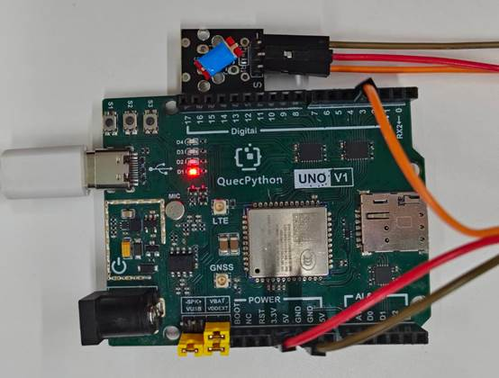

# Tilt Switch Module

## 1. Module Introduction

The tilt switch is a **posture-sensing digital switch device**, also known as a ball switch or topple sensor. It is commonly used in tilt detection, anti-toppling protection, posture triggering, and intelligent alarm scenarios. It can automatically switch level signals when the module is tilted to a certain angle. It has the advantages of small size, no contacts, low power consumption, 3.3V/5V compatibility, direct GPIO detection, sensitive response, and long service life.

**Working Principle**:

The module has a positive electrode, a negative electrode, and a signal terminal. When tilted, the internal ball/conductive liquid moves, turning the internal contacts on or off to output high/low levels. The development board can directly read the state to determine whether it is tilted.

## 2. Connection Example

Connect the peripheral to the development board one-to-one according to the table and picture instructions:

| Peripheral  | Development Board |
| ----------- | ----------------- |
| Module（+） | 3.3V              |
| Module（-） | GND               |
| Module（S） | PIN4(GPIO31)      |



## 3.Driver Code

```python
rom machine import Pin
import utime


class InclinationSwitch:
    """Tilt switch sensor packaging class."""

    def __init__(self, pin=Pin.GPIO31, trigger_level=0, pull=Pin.PULL_PU):
        self.gpio = Pin(pin, Pin.IN, pull)
        self.led = Pin(Pin.GPIO32, Pin.OUT, Pin.PULL_DISABLE, 0)
        self.trigger_level = trigger_level

    def read_state(self):
        return self.gpio.read()

    def is_tilted(self):
        return self.read_state() == self.trigger_level

    def monitor(self):
        while True:
            if self.is_tilted():
                self.led.write(1)
                print("Tilt detected")
            else:
                self.led.write(0)
                print("Level state")
            utime.sleep(1)

def main():
    tilt_switch = InclinationSwitch(pin=Pin.GPIO31, trigger_level=0, pull=Pin.PULL_PU)
    tilt_switch.monitor()

if __name__ == '__main__':
    main()
```

