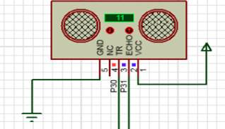
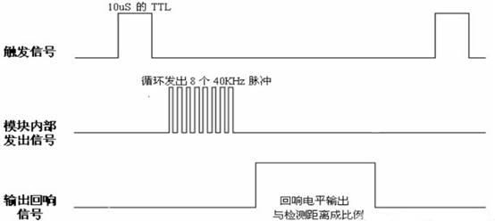
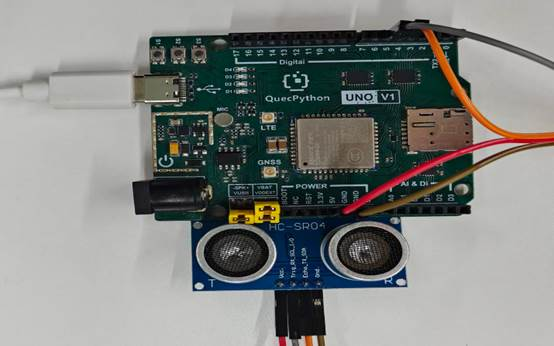

# Ultrasonic Module

## 1. Module Introduction

The working process of HC-SR04 is initiated by a "trigger signal" and feeds back the distance through an "echo signal", with the specific steps as follows:

- Trigger ranging: STM32 outputs a high-level signal of at least 10μs to the Trig pin (high-precision delay is required, which has been implemented in the author's timer notes, please review);
- The module automatically transmits/receives ultrasonic waves: After the Trig receives the trigger signal, the module will automatically send 8 40kHz square waves and start detecting whether the ultrasonic waves are reflected back;
- Echo signal feedback: If the ultrasonic waves are reflected back, the module will output a high level through the Echo pin —— the duration of the high level = the total time for the ultrasonic waves to "transmit to return";
- Distance calculation: Derived from the "time-distance" formula, the final distance = (Echo high-level duration × speed of sound) / 2.

(Note: The speed of sound is 340m/s, divided by 2 because the ultrasonic waves need to "transmit→reflect→return", traveling twice the distance.)

**Core Parameters**:

- Working voltage: **3.3V–5V**
- Measuring range: **2cm–450cm**
- Resolution: 1mm
- Measuring angle: about 15°
- Output mode: **GPIO / I2C / UART**
- Features: non-contact, high precision, fast response, not affected by light and color

​	**schematic diagram**



​	**sequence chart**



 

## 2. Connection Example

Connect the peripheral to the development board one-to-one according to the table and picture instructions:

| **Peripheral Devices** | **Module**   |
| ---------------------- | ------------ |
| Ultrasonic（+）        | VCC(5V)      |
| Ultrasonic（Trig）     | Pin5(GPIO30) |
| Ultrasonic（Echo）     | Pin4(GPIO31) |
| Ultrasonic（-）        | GND          |



##  **3.Driving Code**

```python
from machine import Pin
import utime


class UltrasonicSensor:
    """Ultrasonic distance measurement module packaging category."""

    def __init__(self, trig_pin=Pin.GPIO30, echo_pin=Pin.GPIO31, filter_size=5):
        self.trig = Pin(trig_pin, Pin.OUT, Pin.PULL_DISABLE, 0)
        self.echo = Pin(echo_pin, Pin.IN, Pin.PULL_DISABLE, 0)
        self.filter_size = filter_size
        self.dist_list = []

    def _trigger(self):
        self.trig.off()
        utime.sleep_us(2)
        self.trig.on()
        utime.sleep_us(10)
        self.trig.off()

    def read_distance(self):
        self._trigger()
        t_out = 0
        while self.echo.value() == 0 and t_out < 30000:
            t_out += 1
        if t_out >= 30000:
            return None

        start = utime.ticks_us()

        t_out = 0
        while self.echo.value() == 1 and t_out < 500000:
            t_out += 1
        if t_out >= 500000:
            return None

        end = utime.ticks_us()
        duration = end - start
        distance = duration / 58.0
        return round(distance, 2)

    def read_filtered_distance(self):
        raw_dist = self.read_distance()
        if raw_dist is None or not 2 <= raw_dist <= 800:
            return None

        self.dist_list.append(raw_dist)
        if len(self.dist_list) > self.filter_size:
            self.dist_list.pop(0)
        return round(sum(self.dist_list) / len(self.dist_list), 2)

    def monitor(self, interval_ms=200):
        while True:
            avg_dist = self.read_filtered_distance()
            if avg_dist is not None:
                print("Current distance:", avg_dist, "cm")
            else:
                print("Out of range or signal error")
            utime.sleep_ms(interval_ms)


if __name__ == '__main__':
    ultrasonic = UltrasonicSensor(trig_pin=Pin.GPIO30, echo_pin=Pin.GPIO31, filter_size=5)
    ultrasonic.monitor(interval_ms=200)

```

