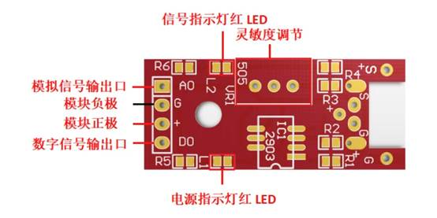
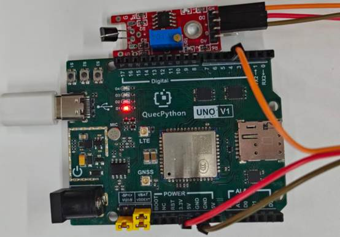

# 人体触摸模块

## **一、** **模块介绍**

该模块是一个基于触摸检测的电容式点动型触摸开关模块。·金属触摸模块是通过人体的电容来作出反应的。由于其是监测电容，还可以在模块表面覆盖非金属材料如木材、纸、塑料等等jue缘材料，来检测人的触摸可做成隐藏在墙壁、桌面等地方的按键。

**模块组成：**

 

**发光原理：**

模块有正极、负极、信号端。人体触摸感应片时，电容值发生变化，模块内部电路识别后输出高低电平信号，开发板可直接读取状态判断是否被触摸。

## 二、 连接示例

根据表格和图片指导，将外设与开发板一一对应连接

| 外设      | 开发板       |
| --------- | ------------ |
| 模块（+） | 3.3V         |
| 模块（-） | GND          |
| 模块（S） | PIN4(GPIO31) |



## 三、 驱动代码

```python
from machine import Pin
import utime


class TouchSensor(object):
    """人体触摸传感器类，通过 GPIO 检测触摸状态。

    应用场景：触摸开关、人机交互、接近检测等。
    """

    def __init__(self, pin=Pin.GPIO31, trigger_level=1, pull=Pin.PULL_PD):
        """初始化触摸传感器实例。

        Args:
            pin: 传感器输入 GPIO 引脚号，默认 GPIO31
            trigger_level: 触发电平，默认 1（高电平触发）
            pull: 上下拉配置，默认下拉 (Pin.PULL_PD)
        """
        self.gpio = Pin(pin, Pin.IN, pull)
        self.trigger_level = trigger_level

    def read_state(self):
        """读取传感器当前电平状态。

        Returns:
            int: 0 或 1
        """
        return self.gpio.read()

    def is_touched(self):
        """判断当前是否被触摸。

        Returns:
            bool: True 表示检测到触摸
        """
        return self.read_state() == self.trigger_level

    def monitor(self, interval_sec=1):
        """轮询监控循环，检测触摸状态。

        Args:
            interval_sec: 轮询间隔，单位秒，默认 1 秒
        """
        while True:
            if self.is_touched():
                print("检测到触摸")
            else:
                print("未检测到触摸")
            utime.sleep(interval_sec)


if __name__ == '__main__':
    touch_sensor = TouchSensor(pin=Pin.GPIO31, trigger_level=1, pull=Pin.PULL_PD)
    touch_sensor.monitor(interval_sec=1)
```

