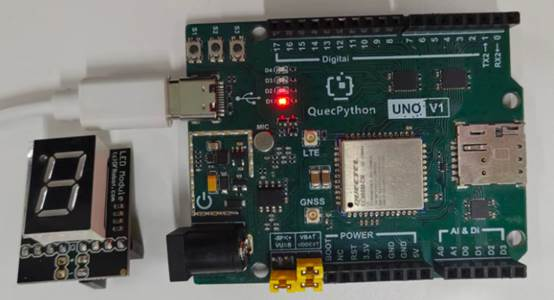

# Digital Tube Module

## 1. Module Introduction

The single-digit nixie tube module is a **digital display device** composed of 7-segment light-emitting diodes, used to display 0-9 digits and simple symbols. It is widely used in counting, timing, status display, and maker DIY scenarios. It features high brightness, clear display, 3.3V/5V compatibility, simple driving, and long service life.

**Composition**:

7-segment LED light-emitting segments, common terminal, decimal point, current-limiting resistor, PCB board, wiring terminal.

**Working Principle**:

The module has a positive electrode, a negative electrode, and a segment selection signal terminal. By controlling the on/off of different segments, it combines to display 0-9 digits, and the development board controls the corresponding segments to light up by outputting levels through GPIO.

## 2. Connection Example

Connect the peripheral to the development board one-to-one according to the table and picture instructions:

| Peripheral | Development Board |
| ---------- | ----------------- |
| LED（+）   | 3.3V              |
| LED（-）   | GND               |
| LED（S）   | Optional          |



## 3.Driving Code

```python
from machine import Pin
import utime


class DigitalTubeDisplay(object):
    """8-segment digital tube display class, controls segment display of
    digits 0-9 via 8 GPIO pins.

    Segment encoding (common anode, 0 = on, 1 = off):
        Index order: [a, b, c, d, e, f, g, dp]

    Example:
        display = DigitalTubeDisplay()
        display.show(5)
        display.countdown(10)
        display.clear()

    Args:
        auto_clear: auto-clear before each display, default True
    """

    _NUM_TABLE = [
        [0, 0, 0, 0, 1, 0, 0, 0],  # 0
        [0, 1, 0, 1, 1, 0, 1, 1],  # 1
        [1, 0, 0, 0, 0, 0, 0, 1],  # 2
        [0, 0, 0, 0, 0, 0, 1, 1],  # 3
        [0, 1, 0, 1, 0, 0, 1, 0],  # 4
        [0, 0, 1, 0, 0, 0, 1, 0],  # 5
        [0, 0, 1, 0, 0, 0, 0, 0],  # 6
        [0, 0, 0, 1, 1, 0, 1, 1],  # 7
        [0, 0, 0, 0, 0, 0, 0, 0],  # 8
        [0, 0, 0, 0, 0, 0, 1, 0],  # 9
    ]

    def __init__(self, auto_clear=True):
        self._auto_clear = auto_clear
        self._segments = [
            Pin(Pin.GPIO32, Pin.OUT, Pin.PULL_DISABLE, 1),  # a
            Pin(Pin.GPIO31, Pin.OUT, Pin.PULL_DISABLE, 1),  # b
            Pin(Pin.GPIO30, Pin.OUT, Pin.PULL_DISABLE, 1),  # c
            Pin(Pin.GPIO33, Pin.OUT, Pin.PULL_DISABLE, 1),  # d
            Pin(Pin.GPIO2,  Pin.OUT, Pin.PULL_DISABLE, 1),  # e
            Pin(Pin.GPIO3,  Pin.OUT, Pin.PULL_DISABLE, 1),  # f
            Pin(Pin.GPIO14, Pin.OUT, Pin.PULL_DISABLE, 1),  # g
            Pin(Pin.GPIO15, Pin.OUT, Pin.PULL_DISABLE, 1),  # dp
        ]
        self._current = None

    def show(self, number):
        """Display the specified digit (0-9), silently ignores out-of-range."""
        if number < 0 or number > 9:
            return
        self._current = number
        values = self._NUM_TABLE[number]
        for seg, val in zip(self._segments, values):
            seg.write(val)

    def clear(self):
        """Clear the display (all segments off)."""
        self._current = None
        for seg in self._segments:
            seg.write(1)

    @property
    def current(self):
        """Currently displayed digit, None if cleared."""
        return self._current

    def countdown(self, start=9, end=0, interval_sec=1):
        """Countdown display."""
        step = -1 if start > end else 1
        for n in range(start, end + step, step):
            self.show(n)
            utime.sleep(interval_sec)

    def demo(self, interval_sec=1):
        """Demo loop, display digits 0-9 sequentially."""
        while True:
            for n in range(10):
                self.show(n)
                utime.sleep(interval_sec)


if __name__ == '__main__':
    display = DigitalTubeDisplay()
    display.countdown(9, 0, interval_sec=1)
    display.clear()
```

