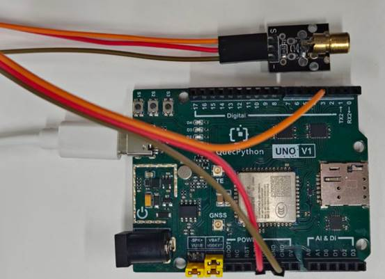

# 激光发射模块

## **一、** **模块介绍**

**激光发射模块（Laser Emitter Module）** 的核心原理是：**通过半导体激光二极管（LD），将电能高效转化为高亮度、高方向性、单色性的相干光（激光），再经光学系统准直 / 整形后发射出去**。它广泛用于激光测距、激光雷达、光纤通信、激光指示、红外夜视等场景。

## 二、 连接示例

根据表格和图片指导，将外设与开发板一一对应连接

| 外设        | 开发板       |
| ----------- | ------------ |
| Module（+） | 3.3V         |
| Module（-） | GND          |
| Module（S） | PIN4(GPIO31) |



## 三、 驱动代码

```python
from machine import Pin
import utime

if __name__=='__main__':
    laser=Pin(Pin.GPIO31,Pin.OUT,Pin.PULL_DISABLE,0)
    while True:
        laser.write(1)
        print("laser on")
        utime.sleep(2)
        laser.write(0)
        print("laser off")
        utime.sleep(2)

```

