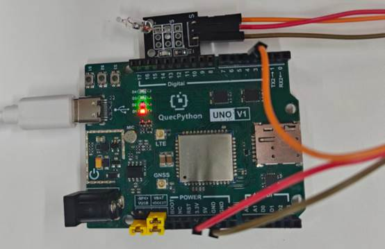

# Mercury switch module

## **1. Module Introduction** 
The mercury switch module is a **gravity-sensing inclination/dumping detection digital switch device**, also known as tilt switch, angle sensor, and is commonly used in scenarios such as inclination alarm, anti-dumping protection, attitude detection, and trigger control; it relies on the flow of mercury to conduct / disconnect the circuit, output stable high or low levels, and has the advantages of **high sensitivity, reliable conduction, no mechanical contact noise, 3.3V/5V compatibility, GPIO direct reading, and small size**. 
**Luminous Principle: ** 
The module has a positive pole, a negative pole and a signal terminal. By taking advantage of the conductivity and fluidity of mercury, when tilted at a certain angle, the mercury flows and connects the electrodes, allowing the circuit to conduct; after resetting, the mercury leaves the electrodes and the circuit is disconnected. The development board determines the tilt state by reading the level.

## 2. Connection Examples 
According to the instructions provided in the table and the pictures, connect each peripheral device to the development board one by one.

| peripheral  | development board |
| ----------- | ----------------- |
| module（+） | 3.3V              |
| module（-） | GND               |
| module（S） | PIN4(GPIO31)      |



## 3. Driving Code

```python
from machine import Pin
import utime


class MercurySwitch(object):
    """Mercury switch sensor class, detects tilt state and controls linked output.

    Application scenarios: tip-over alarm, fall detection, anti-theft devices, etc.
    The mercury switch conducts when tilted to a certain angle, outputting the trigger level.
    """

    def __init__(self, sensor_pin=Pin.GPIO31, output_pin=Pin.GPIO30, trigger_level=1, pull=Pin.PULL_PU):
        """Initialize mercury switch sensor instance.

        Args:
            sensor_pin: Sensor input GPIO pin number, default GPIO31
            output_pin: Linked output GPIO pin number, default GPIO30
            trigger_level: Trigger level, 1 = high level trigger,
                0 = low level trigger, default 1
            pull: Pull-up/down configuration, default pull-up (Pin.PULL_PU)
        """
        self.sensor = Pin(sensor_pin, Pin.IN, pull)
        self.output = Pin(output_pin, Pin.OUT, Pin.PULL_DISABLE, 0)
        self.trigger_level = trigger_level

    def read_state(self):
        """Read the current level state of the sensor.

        Returns:
            int: 0 or 1
        """
        return self.sensor.read()

    def is_triggered(self):
        """Check whether currently in triggered state (tilt detected).

        Returns:
            bool: True means triggered
        """
        return self.read_state() == self.trigger_level

    def update(self):
        """Update linked output based on tilt state."""
        if self.is_triggered():
            self.output.write(1)
            print("Mercury switch detected tilt")
        else:
            self.output.write(0)
            print("Mercury switch no tilt detected")

    def monitor(self, interval_sec=1):
        """Polling monitor loop, detect tilt state and control linked output.

        Args:
            interval_sec: Polling interval in seconds, default 1 second
        """
        while True:
            self.update()
            utime.sleep(interval_sec)


if __name__ == '__main__':
    mercury = MercurySwitch(sensor_pin=Pin.GPIO31, output_pin=Pin.GPIO30, trigger_level=1, pull=Pin.PULL_PU)
    mercury.monitor(interval_sec=1)
```

 