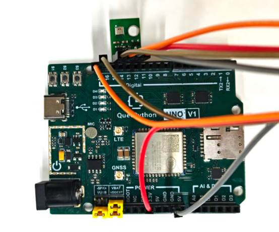

# Temperature and Humidity Sensor

## 1. Module Introduction

As one of the common sensors, the temperature and humidity sensor is a sensor device equipped with humidity-sensitive and temperature-sensitive elements, which can be used to measure temperature and humidity. Its working principle is mainly based on the characteristics of thermistors and humidity-sensitive resistors. It realizes accurate monitoring of environmental temperature and humidity by measuring resistance values and converting them into voltage signal outputs.

**Working Principle**:

The module collects environmental data through internal temperature-sensitive and humidity-sensitive elements, outputs **I2C digital signals** after chip calibration, and the development board reads temperature and humidity values through the I2C bus.

## 2. Connection Example

Connect the peripheral to the development board one-to-one according to the table and picture instructions:

| Peripheral   | Development Board |
| ------------ | ----------------- |
| AHT20（+）   | 3.3V              |
| AHT20（-）   | GND               |
| AHT20（SCL） | PIN17（SCL）      |
| AHT20（SDA） | PIN16（SDA）      |



## 3.Driver Code

```python
from machine import I2C
from utime import sleep_ms


class AHT20(object):
    """AHT20 temperature and humidity sensor class.

    Comfort levels:
        COMFORT_COLD(-1), COMFORT_GOOD(0), COMFORT_WARM(1),
        COMFORT_DRY(2), COMFORT_HUMID(3)

    Example:
        sensor = AHT20()
        rh, temp = sensor.read()
        sensor.monitor()
    """

    COMFORT_COLD = -1
    COMFORT_GOOD = 0
    COMFORT_WARM = 1
    COMFORT_DRY = 2
    COMFORT_HUMID = 3

    def __init__(self):
        self._i2c = I2C(I2C.I2C0, I2C.STANDARD_MODE)
        self._addr = 0x38
        self._RESET_CMD = b'\xBA'
        self._INIT_CMD = b'\xE1'
        self._MEASURE_CMD = b'\xAC\x33\x00'
        self._callback = None

    def set_callback(self, callback):
        """Set temp/humidity callback. callback(temp, rh, comfort_code)"""
        self._callback = callback

    def reset(self):
        """Perform a soft reset."""
        self._i2c.write(self._addr, b'\x00', 0, self._RESET_CMD, len(self._RESET_CMD))
        sleep_ms(20)

    def init(self):
        """Initialize sensor calibration."""
        self._i2c.write(self._addr, b'\x00', 0, self._INIT_CMD, len(self._INIT_CMD))

    def read(self):
        """Read temperature and humidity. RH=RH_reg/2^20*100%, Temp=temp_reg/2^20*200-50.

        Returns:
            tuple or (): (humidity%, temperature°C), empty when busy
        """
        self._i2c.write(self._addr, b'\x00', 0, self._MEASURE_CMD, len(self._MEASURE_CMD))
        sleep_ms(80)
        r_data = bytearray([0x00] * 6)
        self._i2c.read(self._addr, b'\x00', 0, r_data, 6, 80)
        # Check sensor busy status
        if r_data[0] & 0x80:
            return ()
        RH_reg = (r_data[1] << 12) | (r_data[2] << 4) | (r_data[3] >> 4)
        RH = RH_reg / (1 << 20) * 100
        temp_reg = ((r_data[3] & 0x0F) << 16) | (r_data[4] << 8) | r_data[5]
        temp = temp_reg / (1 << 20) * 200 - 50
        return RH, temp

    @staticmethod
    def check_comfort(temp, rh):
        """Judge comfort level (returns numeric constant)."""
        if temp < 18:
            return AHT20.COMFORT_COLD
        elif temp > 28:
            return AHT20.COMFORT_WARM
        elif rh < 30:
            return AHT20.COMFORT_DRY
        elif rh > 70:
            return AHT20.COMFORT_HUMID
        else:
            return AHT20.COMFORT_GOOD

    @classmethod
    def comfort_label(cls, code):
        _labels = {-1:"Cold", 0:"Comfortable", 1:"Hot", 2:"Dry", 3:"Humid"}
        return _labels.get(code, "Unknown")

    def monitor(self, interval_ms=1000):
        """Continuously monitor temperature and humidity."""
        self.init()
        sleep_ms(1000)
        while True:
            res = self.read()
            if res:
                rh, temp = res
                comfort = self.check_comfort(temp, rh)
                label = self.comfort_label(comfort)
                print("Temp: {:.1f}C | Humidity: {:.1f}% | Status: {}".format(temp, rh, label))
                if self._callback:
                    self._callback(temp, rh, comfort)
            else:
                print("Read failed")
            sleep_ms(interval_ms)


if __name__ == '__main__':
    sensor = AHT20()
    sensor.monitor(interval_ms=1000)
```


